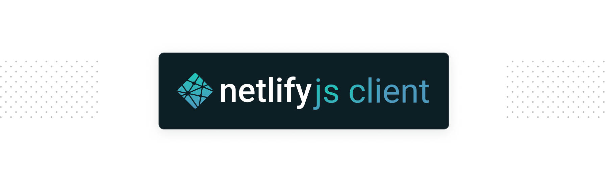

[![npm version][npm-img]][npm] [![build status][build-img]][build] [![coverage][coverage-img]][coverage]
[![dependencies][david-img]][david] [![downloads][dl-img]][dl]

A Netlify [OpenAPI](https://github.com/netlify/open-api) client that works in the browser and Node.js.

## Usage

```js
const NetlifyAPI = require('netlify')

const listNetlifySites = async function () {
  const client = new NetlifyAPI('1234myAccessToken')
  const sites = await client.listSites()
  return sites
}
```

## Using OpenAPI operations

```js
const NetlifyAPI = require('netlify')

const client = new NetlifyAPI('1234myAccessToken')

const listCreateAndDeleteSite = async function () {
  // Fetch sites
  const sites = await client.listSites()

  // Create a site. Notice `body` here for sending OpenAPI body
  const site = await client.createSite({
    body: {
      name: `my-awesome-site`,
      // ... https://open-api.netlify.com/#/default/createSite
    },
  })

  // Delete site. Notice `site_id` is a path parameter https://open-api.netlify.com/#/default/deleteSite
  await client.deleteSite({
    site_id: siteId,
  })
}
```

## API

### `client = new NetlifyAPI([accessToken], [opts])`

Create a new instance of the Netlify API client with the provided `accessToken`.

`accessToken` is optional. Without it, you can't make authorized requests.

`opts` includes:

```js
const opts = {
  userAgent: 'netlify/js-client',
  scheme: 'https',
  host: 'api.netlify.com',
  pathPrefix: '/api/v1',
  accessToken: '1234myAccessToken',
  agent: undefined, // e.g. HttpsProxyAgent
  globalParams: {}, // parameters you want available for every request.
  // Global params are only sent of the OpenAPI spec specifies the provided params.
}
```

### `client.accessToken`

A setter/getter that returns the `accessToken` that the client is configured to use. You can set this after the class is
instantiated, and all subsequent calls will use the newly set `accessToken`.

### `client.basePath`

A getter that returns the formatted base URL of the endpoint the client is configured to use.

### OpenAPI Client methods

The client is dynamically generated from the [OpenAPI](https://github.com/netlify/open-api) definition file. Each method
is is named after the `operationId` name of each operation. **To see a list of available operations, please see the
[OpenAPI website](https://open-api.netlify.com/)**.

Every OpenAPI operation has the following signature:

#### `response = await client.operationId([params], [opts])`

Performs a call to the given endpoint corresponding with the `operationId`. Returns a promise resolved with the body of
the response, or rejected with an error with the details about the request attached. Rejects if the `status` > 400.

- `params` is an object that includes any of the required or optional endpoint parameters.
- `params.body` should be an object which gets serialized to JSON automatically. Any object can live here but refer to
  the OpenAPI specification for allowed fields in a particular request body. It can also be a function returning an
  object.
- If the endpoint accepts `binary`, `params.body` can be a Node.js readable stream or a function returning one (e.g.
  `() => fs.createReadStream('./foo')`). Using a function is recommended.

```js
// example params
const params = {
  any_param_needed,
  paramsCanAlsoBeCamelCase,
  body: {
    an: 'arbitrary js object',
  },
}
```

Optional `opts` can include any property you want passed to [`node-fetch`](https://github.com/bitinn/node-fetch). The
`headers` property is merged with some `defaultHeaders`.

```js
// example opts
const opts = {
  headers: {
    // Default headers
    'User-agent': 'netlify-js-client',
    accept: 'application/json',
  },
  // any other properties for node-fetch
}
```

All operations are conveniently consumed with async/await:

```js
const getSomeData = async () => {
  // Calls may fail!
  try {
    return await client.getSiteDeploy({
      siteId: '1234abcd',
      deploy_id: '4567',
    })
  } catch (error) {
    // handle error
  }
}
```

If the response includes `json` in the `contentType` header, fetch will deserialize the JSON body. Otherwise the `text`
of the response is returned.

### API Flow Methods

Some methods have been added in addition to the open API operations that make certain actions simpler to perform.

#### `accessToken = await client.getAccessToken(ticket, [opts])`

Pass in a [`ticket`](https://open-api.netlify.com/#model-ticket) and get back an `accessToken`. Call this with the
response from a `client.createTicket({ client_id })` call. Automatically sets the `accessToken` to `this.accessToken`
and returns `accessToken` for the consumer to save for later.

Optional `opts` include:

```js
const opts = {
  poll: 1000, // number of ms to wait between polling
  timeout: 3.6e6, // number of ms to wait before timing out
}
```

See the [authenticating](https://www.netlify.com/docs/api/#authenticating) docs for more context.

```js
// example:
const open = require('open') // installed with 'npm i open'

const login = async () => {
  const ticket = await client.createTicket({
    clientId: CLIENT_ID,
  })
  // Open browser for authentication
  await open(`https://app.netlify.com/authorize?response_type=ticket&ticket=${ticket.id}`)
  const accessToken = await client.getAccessToken(ticket)
  // API is also set up to use the returned access token as a side effect
  return accessToken // Save this for later so you can quickly set up an authenticated client
}
```

#### `deploy = await client.deploy(siteId, buildDir, [opts])`

**Node.js only**: Pass in a `siteId`, a `buildDir` (the folder you want to deploy) and an options object to deploy the
contents of that folder. Sometimes this method needs to write to a `tmpDir`. By default `tmpDir` is a folder in the
system temporary directory.

The following paths can be passed in the options:

- `configPath` (path to a `netlify.toml` file that includes redirect rules for the deploy, etc.)
- `fnDir` (a folder with lambda functions to deploy)

Optional `opts` include:

```js
const opts = {
  fnDir: null, // path to a folder of functions to deploy
  branch: null, // branch to pass onto the netlify api
  configPath: null, // path to a netlify.toml file to include in the deploy (e.g. redirect support for manual deploys)
  draft: false, // draft deploy or production deploy
  message: undefined, // a short message to associate with the deploy
  deployTimeout: 1.2e6, // 20 mins
  concurrentHash: 100, // number of parallel hashing calls
  concurrentUpload: 5, // number of files to upload in parallel
  maxRetry: 5, // number of times to try on failed file uploads
  filter: (filepath) => {
    /* return false to filter a file  from the deploy */
  },
  tmpDir: tempy.directory(), // a temporary directory to zip functions into
  statusCb: (statusObj) => {
    // a callback function to receive status events
    // statusObj: {
    //      type: name-of-step
    //      msg: msg to print
    //      phase: [start, progress, stop]
    //  }
    // See https://github.com/netlify/cli/blob/v2.0.0-beta.3/src/commands/deploy.js#L161-L195
    // for an example of how this can be used.
  },
  // passing a deployId will update an existing deploy based on the provided options
  deployId: null,
}
```

## Proxy support

**Node.js only**: If this client is used behind a corporate proxy, you can pass an `HttpsProxyAgent` or any other
`http.Agent` that can handle your situation as `agent` option:

```js
const HttpsProxyAgent = require('https-proxy-agent')

const proxyUri = 'http(s)://[user:password@]proxyhost:port'
const agent = new HttpsProxyAgent(proxyUri)
const client = new NetlifyAPI('1234myAccessToken', { agent })
```

## UMD Builds

A UMD build is provided for your convenience, however browser support is still experimental. Contributions to improve
browser support are welcome.

## Contributing

See [CONTRIBUTING.md](CONTRIBUTING.md) for more info on how to make contributions to this project.

## License

MIT. See [LICENSE](LICENSE) for more details.

[npm-img]: https://img.shields.io/npm/v/netlify.svg
[npm]: https://npmjs.org/package/netlify
[build-img]: https://github.com/netlify/js-client/workflows/Build/badge.svg
[build]: https://github.com/netlify/js-client/actions
[dl-img]: https://img.shields.io/npm/dm/netlify.svg
[dl]: https://npmjs.org/package/netlify
[coverage-img]: https://codecov.io/gh/netlify/js-client/branch/main/graph/badge.svg
[coverage]: https://codecov.io/gh/netlify/js-client
[david-img]: https://david-dm.org/netlify/js-client/status.svg
[david]: https://david-dm.org/netlify/js-client
